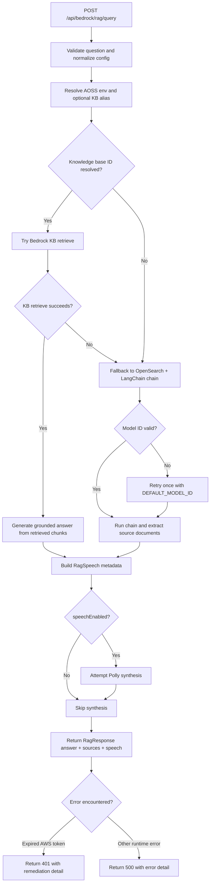

# backend/app.py Grouped Explanation

This guide explains the module by logical blocks rather than one line at a time.

## Quick Navigation

1. [Imports and Runtime Setup](app.py#L1)
2. [Pydantic Models](app.py#L34)
3. [App and CORS Setup](app.py#L108)
4. [Environment and AWS Helpers](app.py#L119)
5. [Contact Delivery Helpers](app.py#L212)
6. [Knowledge Base Alias Helpers](app.py#L294)
7. [Speech and Grounded Answer Helpers](app.py#L382)
8. [Retrieval Pipeline Builders](app.py#L444)
9. [Health Endpoints](app.py#L619)
10. [Contact and Speech Endpoints](app.py#L654)
11. [Main RAG Endpoint](app.py#L727)

## 1) Imports and Runtime Setup

- Range: [app.py](app.py#L1)
- Purpose: Bring in Python stdlib, FastAPI, Pydantic, dotenv, and establish module constants and defaults.

What happens:
- Lines 1-13 import all dependencies.
- Line 15 creates the logger.
- Lines 17-20 locate the project root and load environment files.
- Lines 22-31 define core defaults and required environment variable names.

Example:
- If BEDROCK_CHAT_MODEL_ID is absent, line 26 falls back to amazon.nova-micro-v1:0.

## 2) Pydantic Models

- Range: [app.py](app.py#L34)
- Purpose: Define strict request and response contracts for API routes.

Models defined:
- RagConfig: request tuning options for retrieval and speech.
- RagRequest: question + optional sector + config.
- RagSource, RagSpeech, RagResponse: structured RAG output.
- ContactSubmissionRequest, ContactSubmissionResponse: contact workflow payloads.
- SpeechSynthesisRequest, SpeechSynthesisResponse: direct text-to-speech contract.

Example:
- Contact request field validation enforces non-empty values and a max length of 2000 for request text.

## 3) App and CORS Setup

- Range: [app.py](app.py#L108)
- Purpose: Instantiate FastAPI and apply origin policy.

What happens:
- FastAPI app is created.
- ALLOWED_ORIGINS is parsed as comma-separated values.
- CORS middleware allows configured origins, credentials, all methods, and all headers.

Example:
- ALLOWED_ORIGINS=http://localhost:4202,https://example.com permits both origins.

## 4) Environment and AWS Helpers

- Range: [app.py](app.py#L119)
- Purpose: Centralize env validation, AWS session selection, and region resolution.

Key helpers:
- _required_env: raises when required env is missing.
- _is_expired_aws_token_error: scans exception chain for token-expiry signals.
- _aws_session: tries profile candidates and returns a session with credentials when possible.
- _missing_required_rag_env_vars, _missing_required_contact_env_vars: diagnostics.
- _contact_env_value and _required_contact_env: fallback from process env to backend/.env.
- _resolve_aws_region: resolves region from AWS_REGION, AWS_DEFAULT_REGION, or AOSS_AWS_REGION.

Example:
- If AWS_PROFILE is invalid but default profile has credentials, _aws_session still returns a usable session.

## 5) Contact Delivery Helpers

- Range: [app.py](app.py#L212)
- Purpose: Persist contact data and send notifications.

Functions:
- _store_contact_submission: writes to DynamoDB.
- _send_contact_email: sends SES email notification.
- _send_contact_sms: sends SNS SMS notification.

Behavior note:
- These are designed to be called by the contact endpoint; storage is primary and notifications are secondary.

## 6) Knowledge Base Alias Helpers

- Range: [app.py](app.py#L294)
- Purpose: Map friendly route aliases to actual Bedrock Knowledge Base IDs and surface mapping health.

Functions:
- _resolve_knowledge_base_id: resolves kb- aliases via env.
- _configured_kb_alias_mappings: lists configured alias mappings.
- _frontend_kb_aliases: parses frontend routes for declared aliases.
- _log_missing_kb_alias_mappings: startup warning output.
- _kb_alias_mapping_health: structured diagnostics payload.
- Startup hook: _startup_validate_kb_alias_mappings.

Example:
- kb-machine-learning maps through KB_MACHINE_LEARNING_ID.

## 7) Speech and Grounded Answer Helpers

- Range: [app.py](app.py#L382)
- Purpose: Generate speech output and produce grounded text answers from retrieved context.

Functions:
- _synthesize_speech: calls Polly and returns base64 MP3.
- _generate_answer_from_context: prompts Bedrock chat with strict grounding instructions.

Behavior note:
- If no audio stream is returned, speech helper returns empty string, letting caller decide error handling.

## 8) Retrieval Pipeline Builders

- Range: [app.py](app.py#L444)
- Purpose: Build and run retrieval strategies from Bedrock KB and OpenSearch.

Functions:
- _extract_kb_sources: normalize and dedupe KB retrieve results.
- _query_bedrock_knowledge_base: retrieve chunks from KB then generate answer.
- _build_chain: create OpenSearch-backed ConversationalRetrievalChain with Bedrock embeddings and chat model.
- _extract_sources: normalize and dedupe LangChain source documents.

Example:
- OpenSearch retrieval always enforces at least one result via max(top_k, 1).

## 9) Health Endpoints

- Ranges: [app.py](app.py#L619), [app.py](app.py#L624), [app.py](app.py#L635)
- Purpose: Liveness and configuration diagnostics.

Routes:
- GET /health: simple status check.
- GET /health/config: reports required RAG env readiness.
- GET /health/kb: reports alias mapping and KB resolution health.

## 10) Contact and Speech Endpoints

- Ranges: [app.py](app.py#L654), [app.py](app.py#L697)
- Purpose: Public API routes for contact workflow and direct speech generation.

Contact route behavior:
- Validates config, stores submission, then attempts email and SMS.
- Returns processed_with_warnings if notifications partially fail.

Speech route behavior:
- Validates text, resolves defaults, synthesizes speech, returns audio.

## 11) Main RAG Endpoint

- Range: [app.py](app.py#L727)
- Purpose: Orchestrate full question-answer flow with retrieval, generation, source extraction, and optional speech.

Flow:
1. Validate question and normalize config.
2. Resolve AOSS host and optional KB ID.
3. Try KB retrieval path first when KB ID is available.
4. Fall back to OpenSearch chain if KB path fails.
5. Retry with DEFAULT_MODEL_ID when provided model ID is invalid.
6. Build response with answer, sources, and optional speech.
7. Map expired AWS token errors to HTTP 401; otherwise return HTTP 500 for unhandled failures.

Example:
- If Bedrock KB is temporarily unavailable, the endpoint logs fallback and still answers through OpenSearch retrieval.

## Suggested Study Order

1. Start with [app.py](app.py#L727) to understand end-to-end behavior.
2. Then read retrieval builders in [app.py](app.py#L444).
3. Then review env/session helpers in [app.py](app.py#L119).
4. Finish with models in [app.py](app.py#L34) to lock in request and response contracts.

## Call Flow Diagram

Line references for this flow:

1. Entry and validation: [app.py](app.py#L727)
2. KB alias resolution and AOSS setup: [app.py](app.py#L738)
3. KB-first retrieval attempt and fallback: [app.py](app.py#L749)
4. OpenSearch chain execution and invalid-model retry: [app.py](app.py#L766)
5. Speech synthesis branch: [app.py](app.py#L787)
6. Error mapping (401 vs 500): [app.py](app.py#L800)
